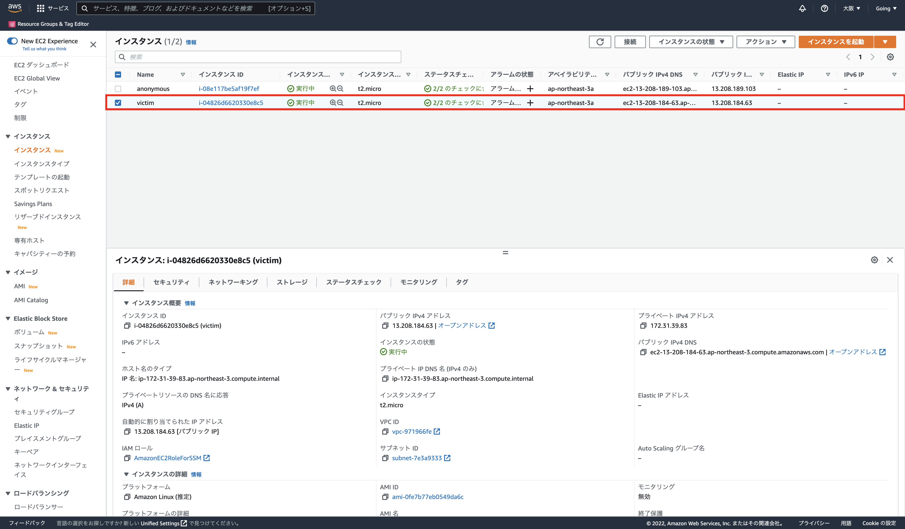
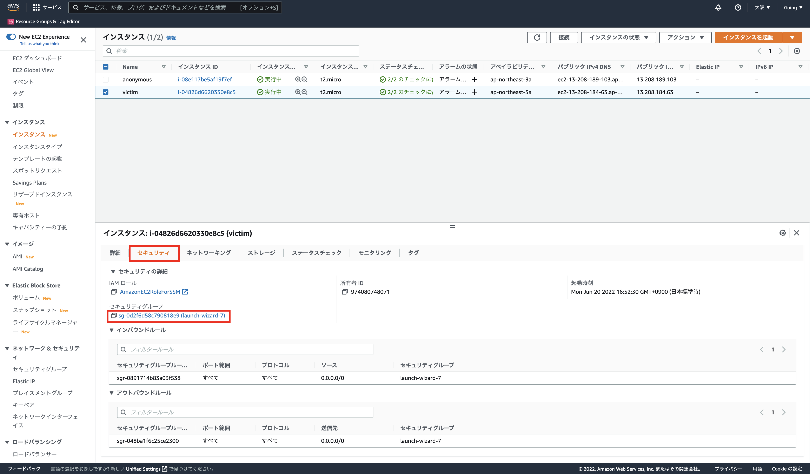
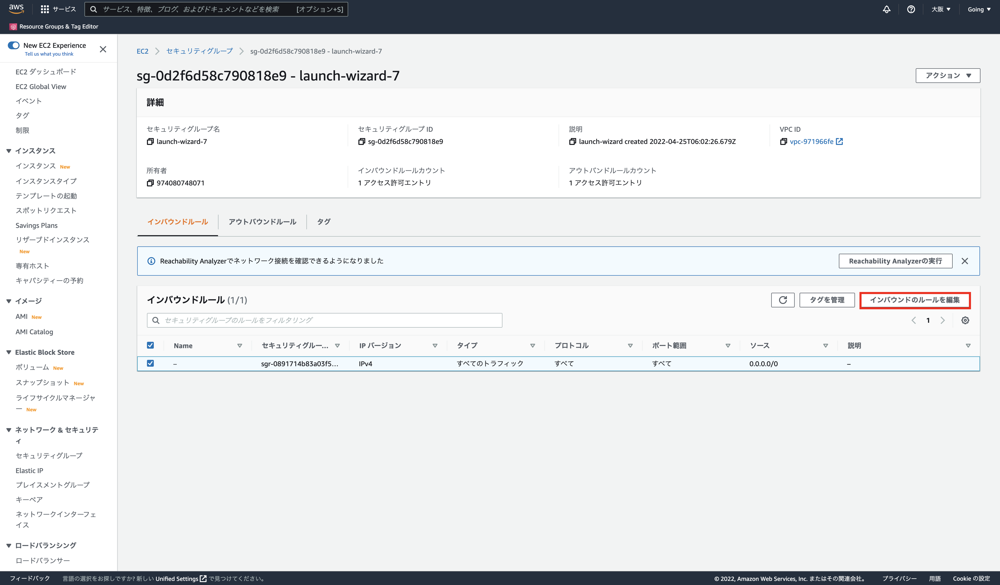
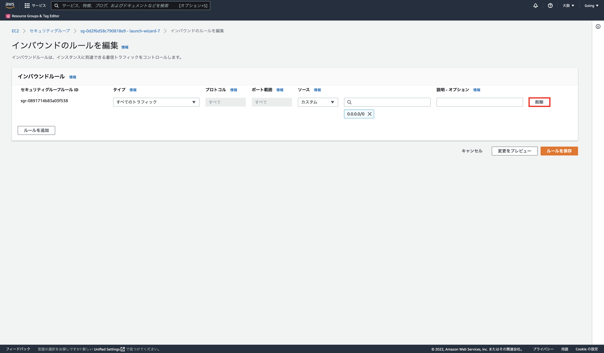
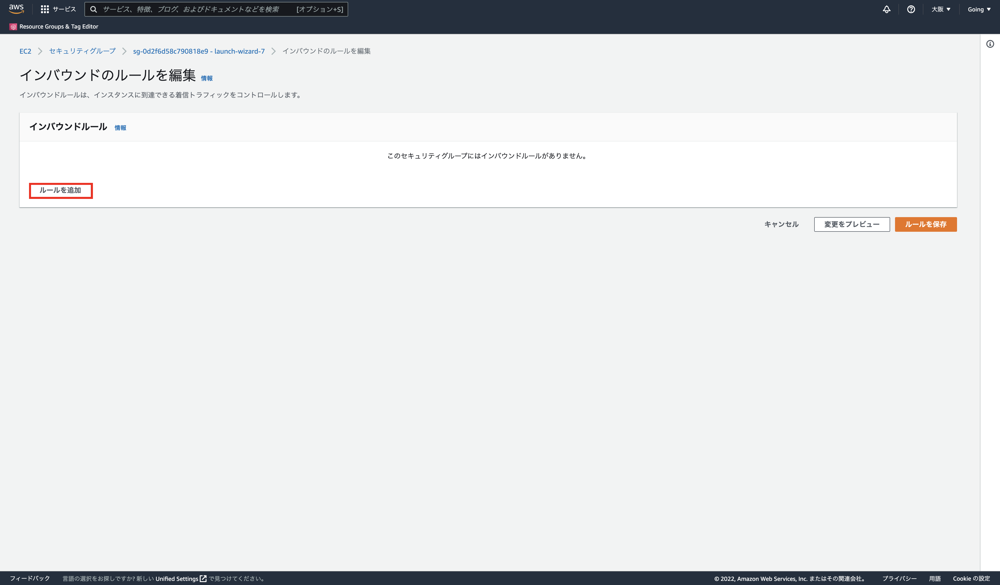
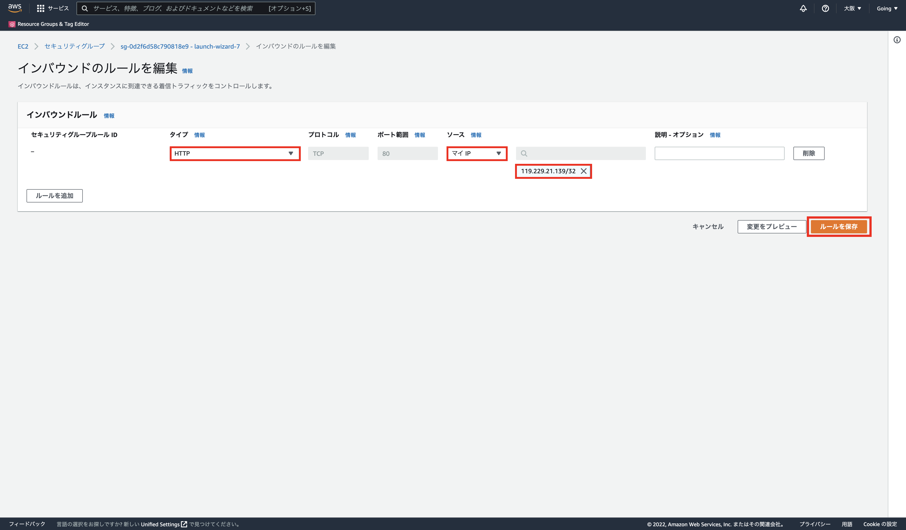
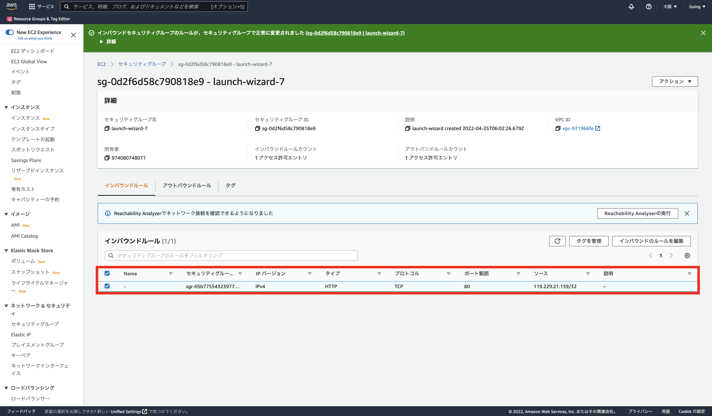
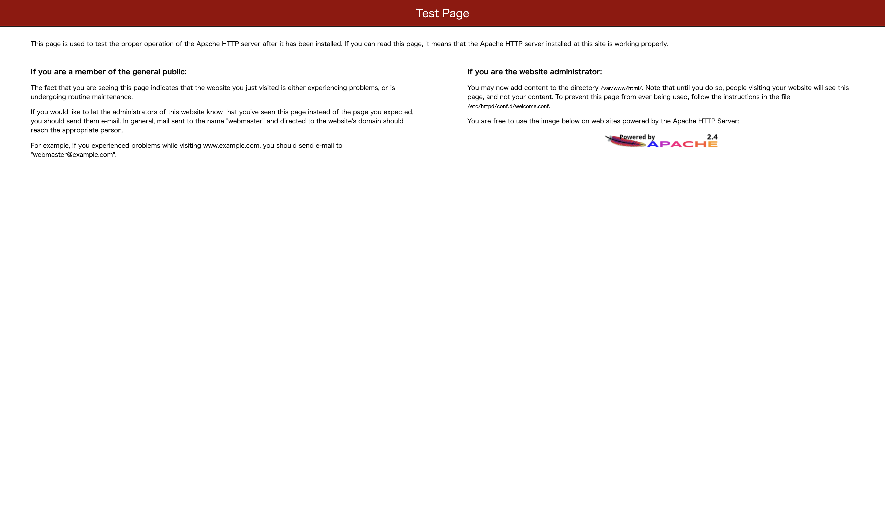

# DDoS攻撃の対策
今回の実験では，事前・事後テストに関する出題内容と設定している学習時間の関係で，一つの攻撃の種類に固定しています．  
攻撃の種類はHTTP Flood攻撃でした．

これからHTTP Flood攻撃の応急措置的な対策を施してもらいます．  
対策にはAWSのマネジメントコンソールを用いて実施していきます．  

マネジメントコンソールから，EC2の管理画面にアクセスし，攻撃の被害を受けているインスタンスである`victim`を選択します．  
そこからセキュリティを選択して，適切な設定を施されているか確認していきます．  

セキュリティのインバウンドルールに注目すると，全ポートと全プロトコルにどこからでもアクセスできるようになっており，非常に脆弱なセキュリティになっていることが確認できます．  
この設定が原因で，DDoS攻撃の標的となってしまっているので，適切なセキュリティ設定に変更していきます．  
編集にはまず，セキュリティグループのIDをクリックします．

次に「インバウンドのルールを編集」を選択します．

「削除」を押下して，既存の脆弱なインバウンドルールを削除します．

「ルールを追加」を押下して，新しいインバウンドルールを追加します．

今回追加するインバウンドルールは，まず外部からの攻撃をセキュリティ設定で弾けるかを目標とし，設定していきます．  
セキュアな環境からのみアクセスできるようにするため，自分が属するネットワークからのみHTTP通信を可能とするルールを作成します．  
タイプの部分はHTTPを選択し，ソースはマイIPで自分のIPアドレスを設定します．  
最後にルールを保存を押下します．

以下のように，新しいインバウンドルールが追加されたことを確認できたら，修正は完了です．

追加したインバウンドルールで，外部からの通信を弾いているか，確認していきます．  
ブラウザのアドレスバーに再度`victim`のIPアドレスを入力してください．   
適切に対策できている場合は，攻撃元のIPアドレスを弾いて，正常にアクセスできるようになります．

今回の実験ではインバウンドルールの修正だけでしたが，さらに実践的な対策としてAWS WAFの導入があります．  
攻撃元は米国だったので，この機能を導入することにより，海外からのアクセスを防ぐことができるといったことも本システムで学習できます．  
また，**攻撃の検知で使用したCloudWatchは自動検知が可能で，ある閾値を超過した場合，使用者にアラートを送信して異常を知らせます．**  
これにより，もし攻撃を受けてしまっても，迅速な対応が可能となります．

本演習では，HTTP Flood攻撃だけの対策演習でしたが，**SYN Flood攻撃やUDP Flood攻撃などのレイヤーの低い攻撃には，AWS Sheild Advancedの導入が有効です．**  
AWS Shield Advancedは，DDoS攻撃専用の保護サービスとなっており，大規模で高度な攻撃にも対応できる性能を持っています．  

このように，攻撃に応じて様々なサービスを用いることで，DDoS攻撃から保護された環境の構築が可能となります．

以上で，対策演習は終了となります．  