# ようこそ，対策演習へ！
ここは，DDoS攻撃の対策演習ページです．

### 実験の流れ
今回の実験では，DDoS攻撃の検知から対策まで学習してもらいます．

対策演習の大まかな流れとして．
1. CloudWatchを用いた攻撃の検知
2. Wiresharkを用いた攻撃の分析
3. AWSを用いた対策

になっています．  

それではやっていきましょう！！
## EC2へのログイン
まずは，対策を施していくEC2にアクセスしていきます．  
AWSのマネジメントコンソール検索機能に，ec2と入力してください．

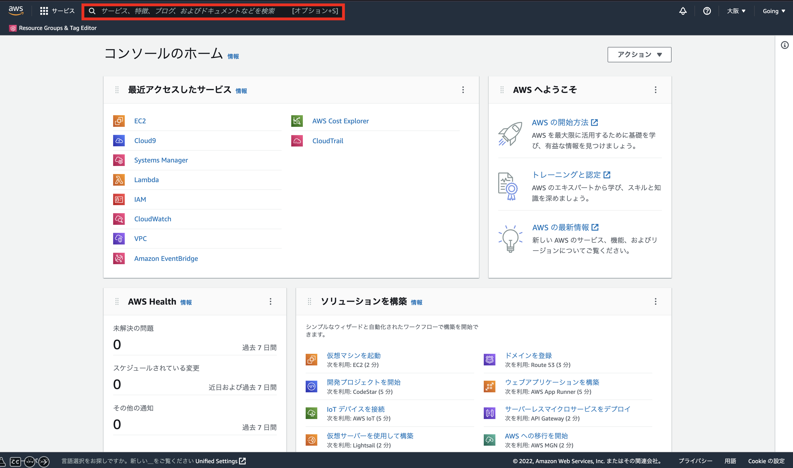

すると候補にEC2が出てくるので，それを選択してください．

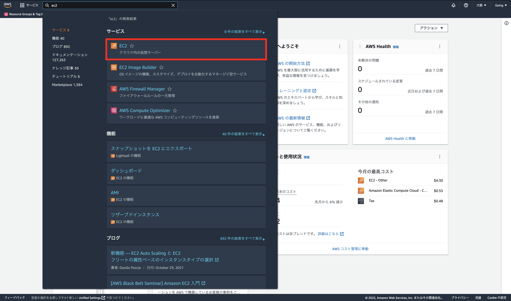

インスタンスが表示されていると思います．  
`anonymous`は，攻撃演習でみなさんがCloud9を用いてアクセスしていたインスタンスです．  
`victim`は，対策演習で扱っていくインスタンスになります．  

今回使用する`victim`を選択してください．

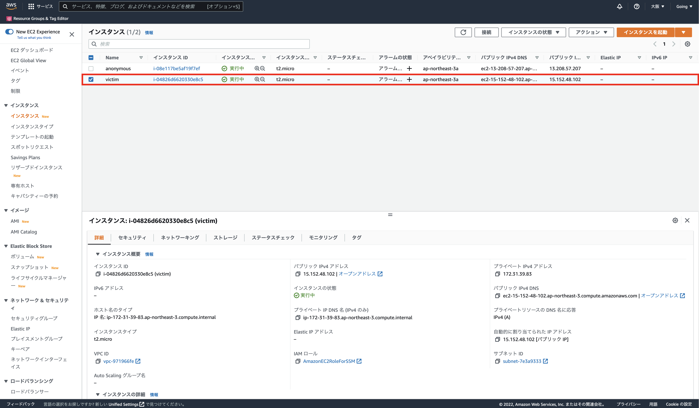

次に`接続`を選択してください．

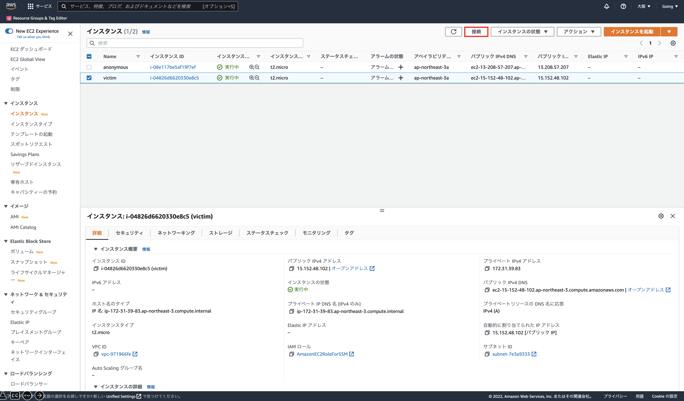

セッションマネージャーを選択して，`接続`を押下してください．  
稀に`接続`を押下できないことがありますが，その際はインスタンスが表示されてるところまで戻って再度トライしてみてください．  
いつか接続できます．

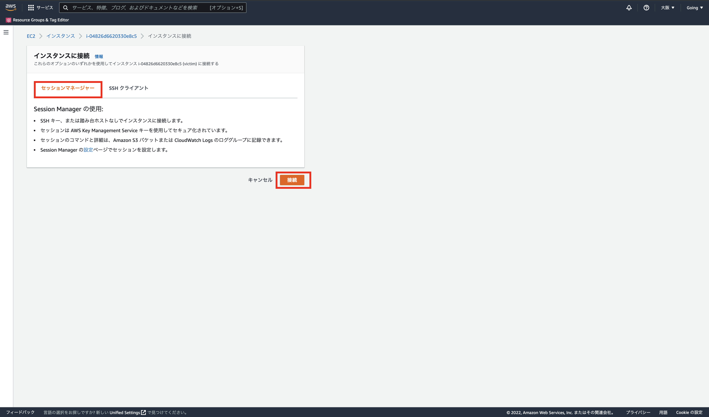

接続できたら，コンソールが表示されます．  
スーパーユーザーで演習を実施していくので，sudoでログインしていきます．

コマンドは`sudo su`です．

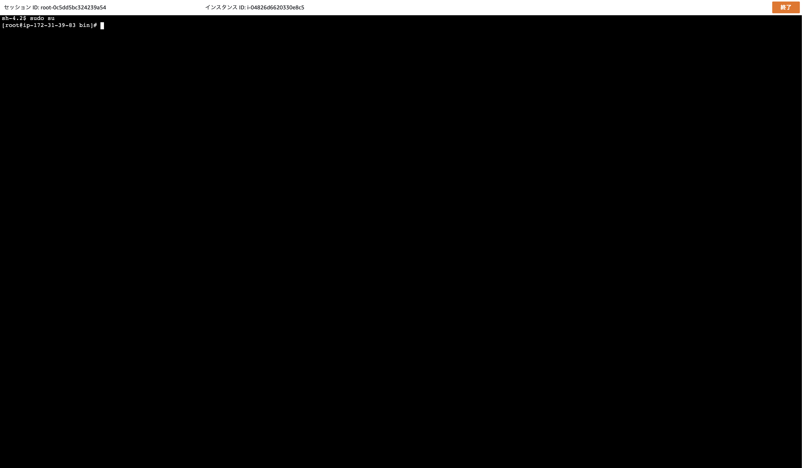

ログイン時は，演習で扱うディレクトリにいないので，cdで移動していきます．  
本演習で扱うディレクトリ場所は`/home/ec2-user`です．

コマンドは`cd /home/ec2-user`となります．

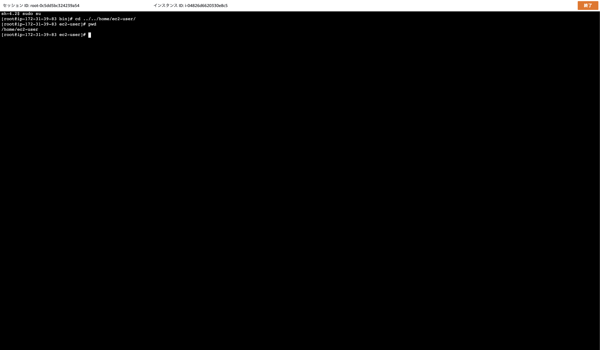

これで対策演習に向けての準備が完了しました！！

### victimの利用想定
対策演習に取り組んでもらうにあたって，今回どんな用途に用いるインスタンスなのか説明しておきます．  
利用想定として，
1. 社内向けWebアプリケーションのインスタンス
2. テレワークの影響で社外からのアクセスを必要とするが，海外からのアクセスは必要とせず，国内で提供が完結するものである
3. 平均してWebアプリケーションのアクセス数は低い

となっております．   
この想定に沿って対策演習を実施していきます．

## Webサイトへアクセスできるか確認
提供しているWebアプリケーションにアクセスできるか確認していきましょう．  
ブラウザのアドレスバーに，`victim`のIPアドレスを入力してアクセスしてみてください．  

victimのIPアドレスは，EC2管理画面にある以下の赤枠に表示されています．

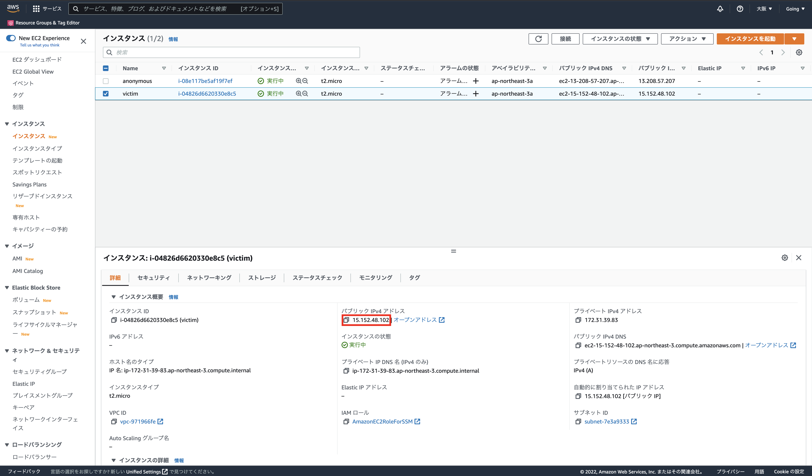

すると，サーバからの応答時間が長く，**場合によっては**以下のような画面が表示されて，アクセスできない状態になっていると思います．  

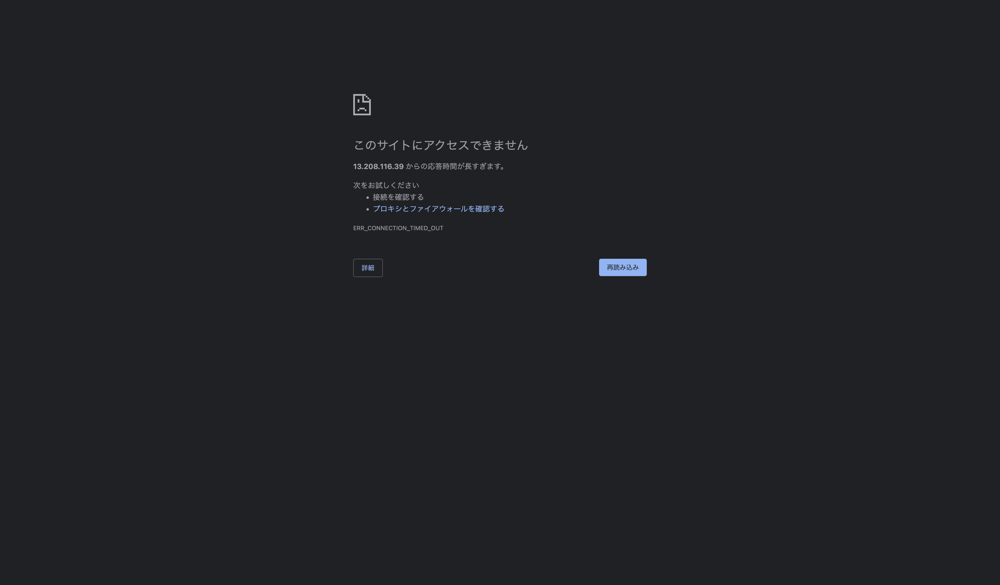

これにより，なんらかの異常がWebアプリケーションに発生していることが確認できます．  
では次に，なぜこのような状態になってしまっているのか特定していきましょう．

## 原因の特定
CloudWatchを用いてインスタンスの異常を特定していきます．  

CloudWatchまでアクセスするには，まずAWSのマネジメントコンソールの検索欄を選択します．  


検索欄に，cloudwatchと入力すると，候補のサービスにCloudWatchが出てくるので，それを選択してください．

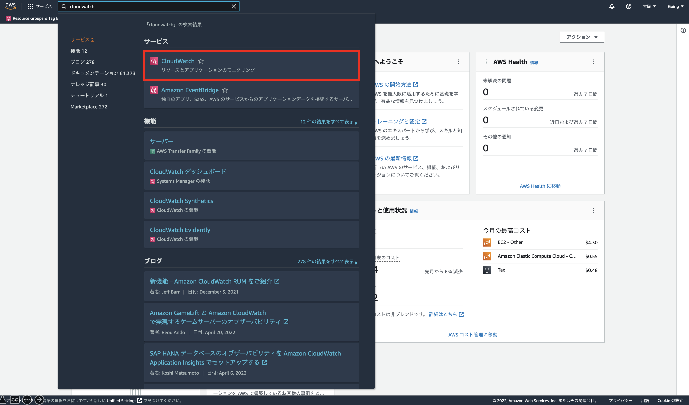

そうすると，このようなCloudWatchの画面が表示されると思います．  

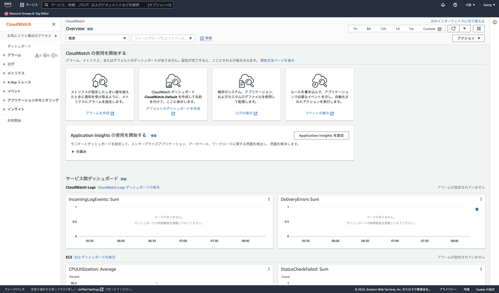

今回はEC2にフォーカスした演習に取り組んでもらうので，EC2ダッシュボードの表示をクリックしてください．

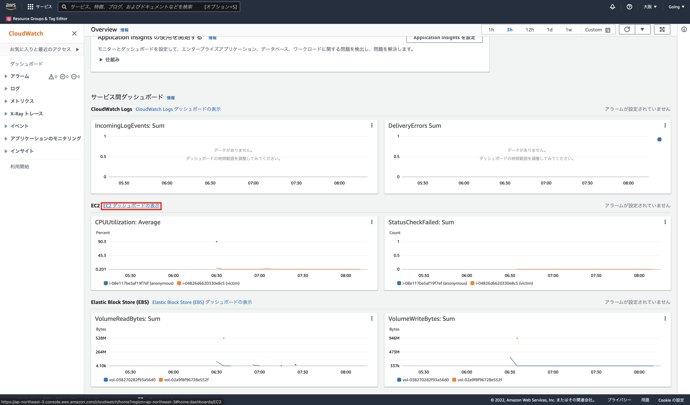

そうすると，このようなEC2のダッシュボードが現れます．  
表示されているグラフに注目すると，青色とオレンジ色の折れ線グラフが表示されていると思います．  
青色は攻撃演習で用いた`anonymous`で，オレンジ色が対策演習で用いる`victim`となっています．  
今回は`victim`のダッシュボードのみを扱うので，`anonymous`の表示は消します．  
表示の消し方は，グラフ下にある青い色の四角をクリックすると，オレンジ色だけが見えるようになります．

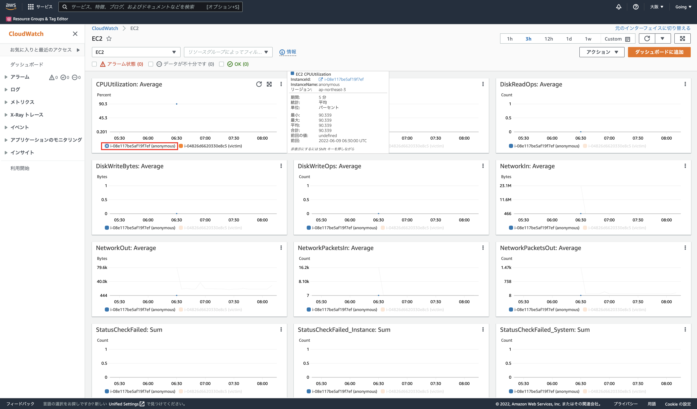

ダッシュボード赤枠の部分を見ると，インスタンスCPU使用率の急激な上昇と大量のパケットが送られてきていることが確認できます．  
これが要因となってWebアプリケーションにアクセスしにくい状態が続いている可能性が高いことが考えられます．

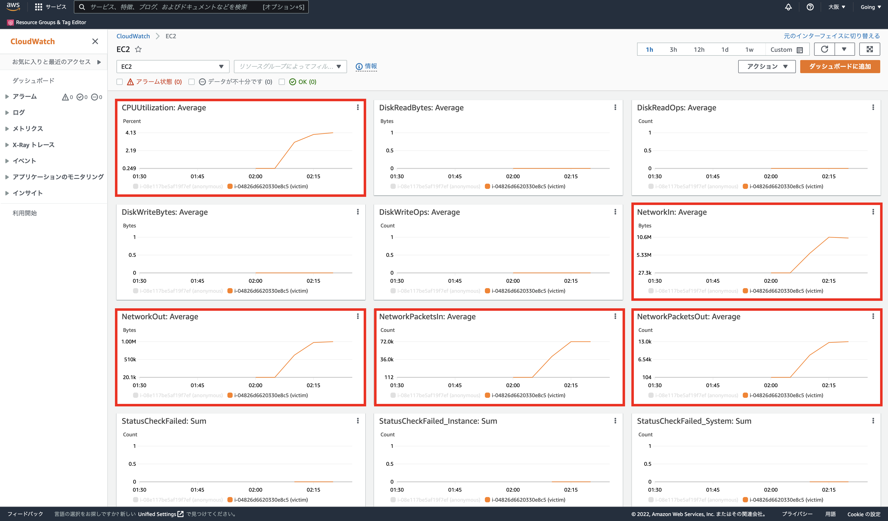

## パケットの分析
では次に正常な通信によって問題が発生しているのか，悪意のある通信によって問題が発生しているのかを，パケット解析により特定していきます．  
先ほど`victim`に接続した画面を開いてください．  
パケットを解析するために，tcpdumpでパケットをキャプチャします．  

コマンドは`tcpdump -s 0 -w /home/ec2-user/output/dumpfile.pcap -W1 -G10`です．  
`-s 0 -w /home/ec2-user/output/dumpfile.pcap`でoutputフォルダにキャプチャしたdumpfile.pcapを出力し，`-W1 -G10`は10秒間パケットをキャプチャする処理を行なっています．  

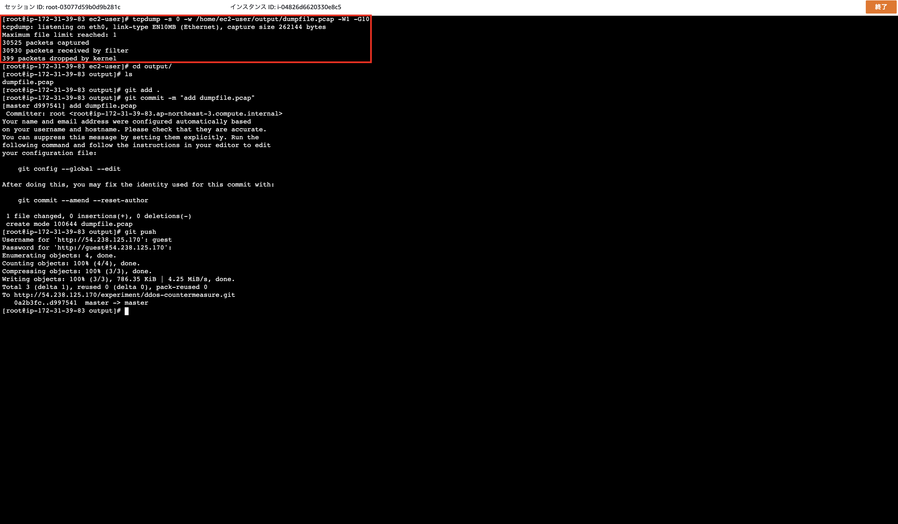

次に出力した`output`ディレクトリに移動し，キャプチャファイルをローカルへ保存するために，ファイルをGitLabにアップロードします．
`cd output`で移動し，`ls`でdumpfile.pcapがあることを確認します．  

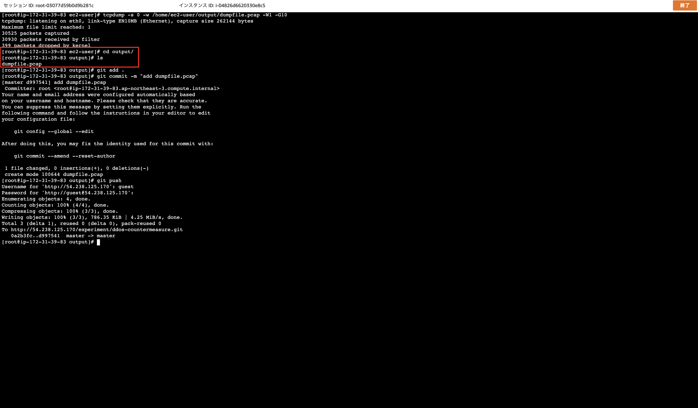

`git pull`  
`git add .`  
`git commit -m "add dumpfile.pcap"`  
で追加ファイルをコミットします．

あとは`git push`をして，ユーザ名とパスワードを入力したら，アップロードは完了です．
```
ユーザ名：guest
パスワード：Kindai+5427!
```

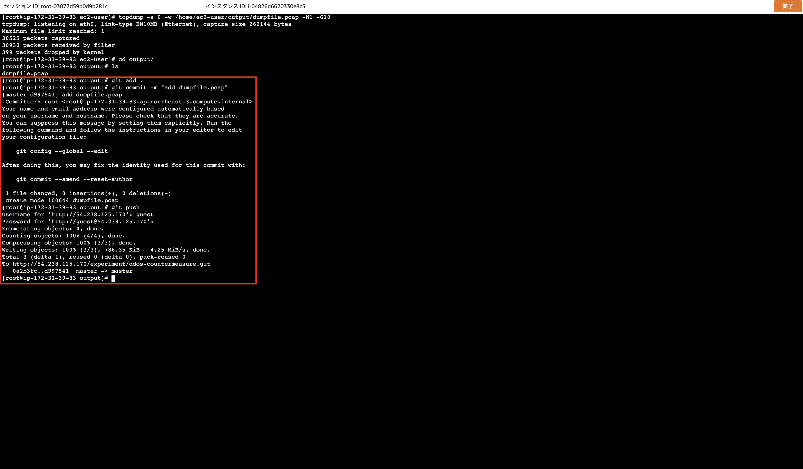

GitLabを更新してみると，dumpfile.pcapがあることが確認できます．

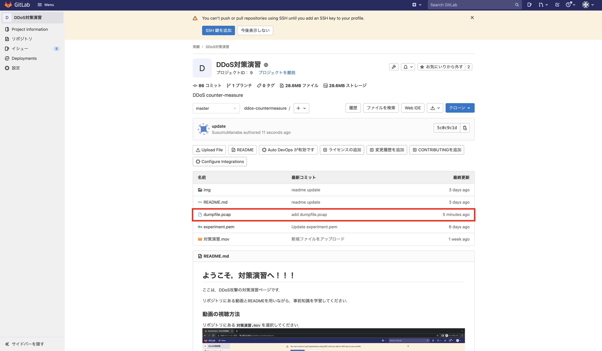

ファイルをクリックして，保存ボタンを押下することで，ローカルに落としてきます．

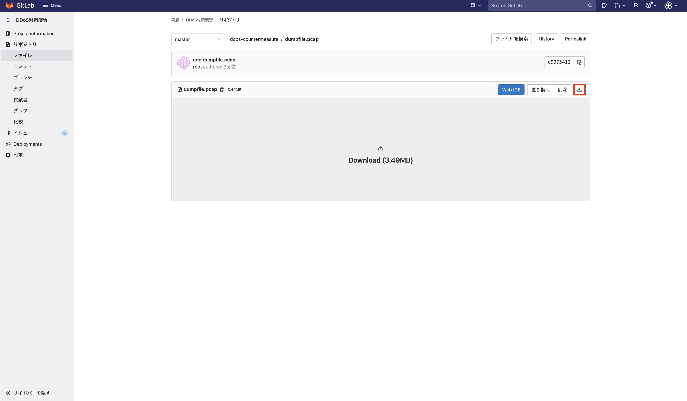

次にローカル環境でWiresharkを起動します．

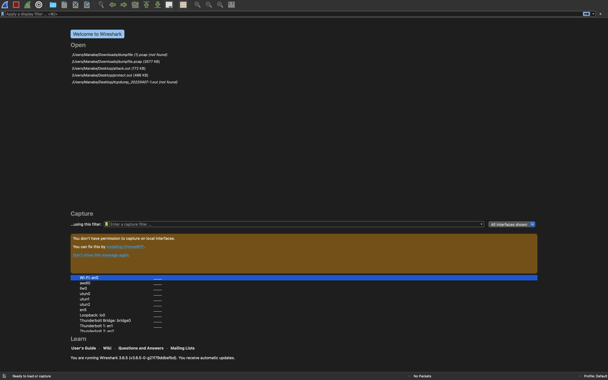

ダウンロードしたキャプチャファイルを，Wiresharkにドラッグ＆ドロップすることで，パケットの中身を解析していきます．

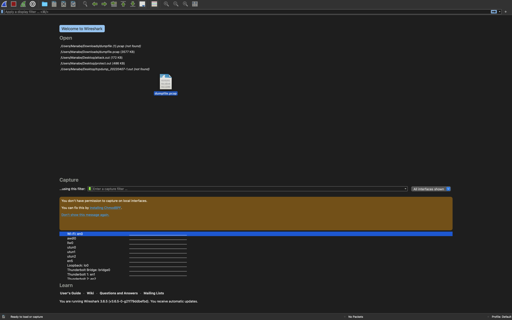

Wiresharkでパケットを見てみると，複数の送信元から悪意のある大量のパケットが送られていることが確認できます．  
また，いずれかの送信元IPアドレスを検索にかけてみてください．  
すると悪意のある通信が海外から実施されていることを確認できます．  
これにより海外(米国)の複数のIPアドレスから悪意のあるパケットを送信されている点から，海外に構築されたボットネットを用いたDDoS攻撃であると断定できます．  
ちなみに，最もサイバー攻撃をしている国は一番が中国となっており，2番目に米国であると言われています．

では，DDoS攻撃の対策をしていく上で重要な，種類の特定を行なっていきます．

## 攻撃の種類を特定
DDoS攻撃の種類を特定していきます．  
今回の演習では，SYN Flood攻撃，ICMP Flood攻撃，UDP Flood攻撃，HTTP Flood攻撃の4つからランダムに実施されます．  
それぞれ攻撃のパケットに関する特徴について，以下のリンクを参照してください．  
これらのリンクを参考に，攻撃の種類を特定してください．  

[SYN Flood攻撃: パケットの特徴](wireshark/syn_flood.md)

[ICMP Flood攻撃: パケットの特徴](wireshark/icmp_food.md)

[UDP Flood攻撃: パケットの特徴](wireshark/udp_flood.md)

[HTTP Flood攻撃: パケットの特徴](wireshark/http_flood.md)


## DDoS攻撃の対策

AWS上でDDoS攻撃の対策を施していきます．  
対策手法は以下にまとめており，実施した攻撃の種類も書いているので，特定できた方のみ参照してください．

[DDoS攻撃対策編](ANSWER.md)

