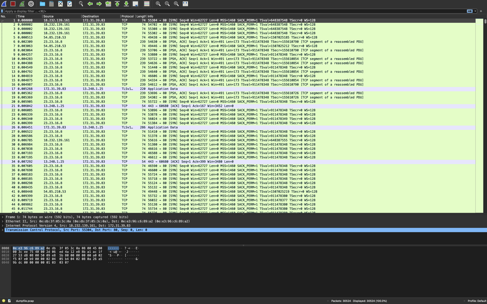
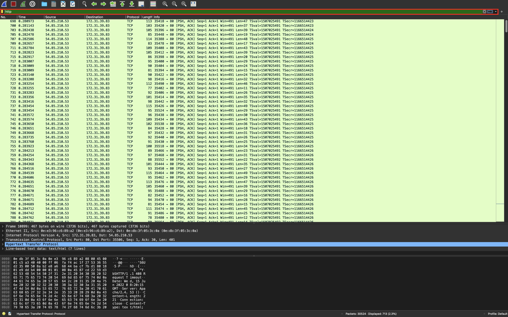

# HTTP Flood攻撃パケットの特徴

Wiresharkの解析結果からは，正常な通信をしているように見えますが，短時間で大量のパケットが送信されていることを確認できます．  

HTTP Flood攻撃か特定するために，Wiresharkのフィルタ部分にHTTP通信のみを表示する`http`と入力してください．  

通信内容をスクロールして確認すると，サーバがHTTP GETリクエストを処理しきれなくなり，Request Timeoutが大量に表示されています．  
ちなみに，SYN Flood攻撃とHTTP Flood攻撃の違いとしては，SYN Flood攻撃はHTTP通信を行なっていないため，HTTPのフィルタをかけても何も出力されない点が挙げられます．

このように，短時間でHTTP GETリクエストを大量に送信し，サービスを妨害するHTTP Flood攻撃を受けていることが特定できます．  
