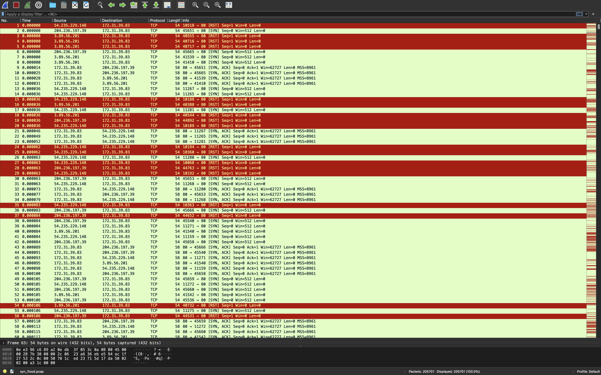
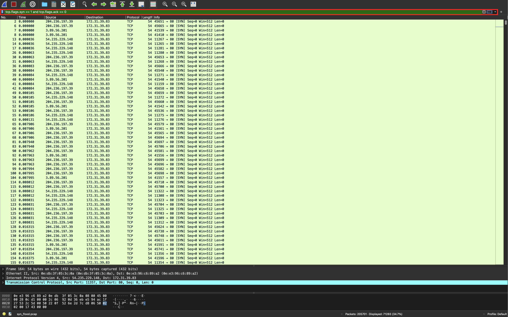

# SYN Flood攻撃パケットの特徴

Wiresharkの分析結果から，SYNパケットを短時間で大量に受信していることを確認できます．  
また，相手からの応答がないため，通信の切断が発生し，赤色のパケットが表示されています．

悪意のあるSYNパケットを送られているか，Wiresharkのフィルタ機能を用いて判別していきます．  
フィルタ部分に  
`tcp.flags.syn==1 and tcp.flags.ack==0`  
と入力してください．

`tcp.flags.syn==1`は，SYNフラグが設定されたパケットを表示し，  
`tcp.flags.ack==0`は，ACKフラグが設定されてないパケットを表示します．

つまり，TCPの接続要求するSYNパケットのみを大量に送り付け，ACKパケットの返信を放置するSYN Flood攻撃を受けているか確認できます．

フィルタすると，以下のように，応答を行わないSYNパケットが出力されます．

以上のことから，悪意のあるSYNパケットを大量に受信しているため，サービスを妨害するSYN Flood攻撃を受けていることが特定できます．